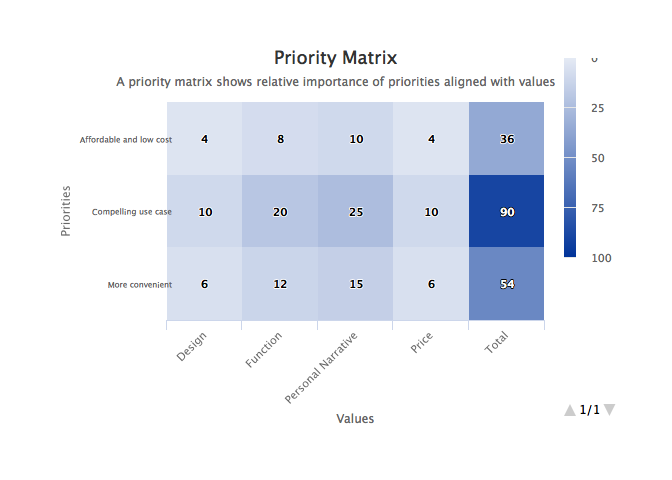
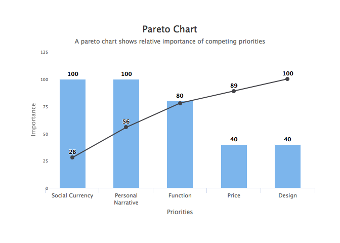
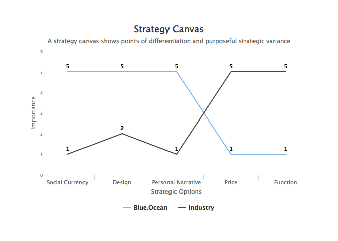

ReadMe
================

The Priority Matrix package helps make strategic decisions by utilizing the following tools: \* Prioritization Matrix \* Pareto Analysis \* Strategy Canvas

Installation
------------

You can install the Priority Matrix package by using the devtools github installer in R:

``` r
library(devtools)
devtools::install_github("jsdeherrera/prioritizationMatrix")
```

Prioritization Matrix
---------------------

Prioritization matrices are a standard part of the Six Sigma toolkit. They can be used to make difficult decisions by aligning options according to our values and priorities. Based on the interactions of these two sets of values and how well given options satisfy both, we can more easily determine the best path (as well as which paths we should avoid because they do not align with either our values nor priorities).

Example of prioritization matrix:

``` r
library(priorityMatrix)
priorities <- c("Compelling use case","Affordable and low cost","More convenient")
values <- c("Social Currency","Price","Design","Function","Personal Narrative")
vImport <- c(5,2,2,4,5)
pImport <- c(5,2,3)
hc1 <- createHeatmap()
hc1
```



Pareto Analysis
---------------

The 80/20 rule is a filtering mechanism that allows us to focus on the most important members of a population. It's broad applicability can be seen in \[Benford's Law\]\[<https://en.wikipedia.org/wiki/Benford%27s_law>\] due to how \[information entropy\]\[<https://en.wikipedia.org/wiki/Entropy_(information_theory)>\] works. Basically, roughly 80% of any given result is due to just 20% of our efforts.

Example of Pareto chart:

``` r
pOptions <- c("Social Currency","Price","Design","Function","Personal Narrative")
poImport <- c(5,2,2,4,5)
hc2 <- createParetoChart(pOptions,poImport)
hc2
```



Strategy Canvas
---------------

A strategy canvas is a tool made popular by the book, \[Blue Ocean Strategy\]\[<https://en.wikipedia.org/wiki/Blue_Ocean_Strategy>\]. The basic premise is that in order to compete effectively, enterprises need to purposely decide how they will be different from their competitors. This results in low cost to produce, high value outputs.

Example of strategy canvas:

``` r
sOptions <- c("Social Currency","Price","Design","Function","Personal Narrative")
soImport1 <- c(1,5,2,5,1)
soImport2 <- c(5,1,5,1,5)
hc3 <- createStrategyCanvas(sOptions,soImport1,soImport2)
hc3
```



Vignette
--------

A vignette of the package is available in the vignettes folder.

Travis
------

The current build of this package has been tested and passed by Travis. [](https://travis-ci.org/jsdeherrera/prioritizationMatrix)
